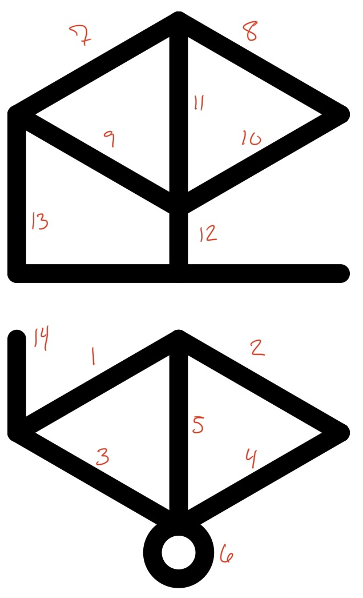
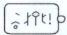

# Tunic Linguistic Deciphering Resource (TLDR)

A webapp I made while playing [Tunic](https://tunicgame.com/) to help me decipher the in-game constructed writing system ("Trunic").

## Background / The Problem

Tunic is a game that starts you off with no instructions whatsoever; you must discover everything for yourself — including like, what the buttons do. Among the things you discover scattered throughout the world are "pages" from an in-game instruction booklet (the game is actually full of delightful puzzles and secrets, and Trunic is only one of them).

an example instruction booklet page

The majority of the text in these pages (and other in-game text) is written in Trunic, with only some key words written in the user's selected language (which need not be English, but Trunic is a neography for English).

other in-game Trunic

As you can see in the image above, Trunic is written as a series of "runes" (hence "Trunic" haha get it)(I think they're not technically "runes" per se as that term has a particular meaning in linguistics but you get it). Each rune has a horizontal midline, separating each rune into upper and lower parts, and serving as a way to demarcate words (when there is a break in the line).

At first I thought the upper and lower parts of each rune had separate meanings, and took to calling those separate parts (generically) **glyphs** and the full rune unit a **grapheme**.

Pretty sure those terms aren't linguistically accurate, but whatever they're what I used! I suppose I could've called the separate parts "letters" but that felt wrong.

Deciphering Trunic isn't strictly necessary to the game but like what am I gonna do, not figure it out?? Anyway at first I took screenshots of Trunic text and manually tried to find patterns, jotting down notes, looking for commonly used glyphs, inferring context clues. I made a bit of progress, and though I'm sure it would've been rewarding in its own way to pore over a huge pile of papers like a linguistic archaeologist, I thought it would be a fun project to create a tool that sped up the pattern searching process. So I made this!

## The Solution

### Outline

The basic idea for the tool was this:

1. Upload a screenshot of in-game Trunic.
2. Type in the Trunic text and associate it with the image.
3. Break the Trunic text up into words, graphemes, and glyphs.
4.
5.

### Glyph Entry

The first problem to solve was how to input glyphs. Each glyph in Trunic is essentially a subset of these segments:

*don't ask me why I numbered them that way

The horizontal line is always pressent in the glyph. However, in some styles, or when handwritten (see below), the horizontal midline and whitespace are removed, creating a more condensed version:

hexagonal and handwritten Trunic examples

Easier to see in the condensed version is the fact that:

1. The leftmost vertical lines act as one segment, and
2. What I numbered segment 12 is basically stylistic. It's only present if either the upper or lower vertical line (11 or 5) is also present and it has another segment to connect to; it has no linguistic meaning.

#### Encoding

I had figured out #1 above, but not #2, when I designed my encoding. So I was left with 13 potential segments per glyph. Treating the presence of each segment as a boolean, I encoded glyphs and graphemes as bit arrays and stored them each as a number (between 0 and 8191). (See [glyph.ts](src/glyph.ts) for the encoding). This meant words would be an array of numbers, which seemed neat. It also meant that when "typing" a glyph, toggling a segment on and off was as simple as bitwise operations on the current glyph value.

#### Input

Now I have a way to store glyphs and graphemes as numerical data.
